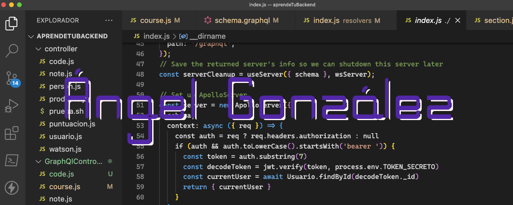

## Hi, I'm Angel 👋


 

```javascript
{
    "username": "Angel",
    "name": "Ángel González",
    "twitter": "@angelgon3",
    "code":{
        "frontend": ["HTML", "CSS", "JavaScript", "ReactJS", "Svelte", "Boostrap", "TailWind"],
        "backend": ["Python", "PHP", "Flask", "Django", "Laravel", "NodeJS", "Odoo"],
        "database": ["PostgreSQL", "MySQL", "SQLite3", "MongoDB", "Firestore"],
        "devops": ["Docker", "Nginx", "Jenkins", "GitHub Actions", "AWS", "Heroku", "RailWay"],
        "tools": ["GIT", "GitHub", "GitLab", "Pandas", "Jupyter notebook", "Redis", "Celery"],
        "misc": ["Firebase", "TDD", "SCRUM", "SOLID", "GNU/Linux"]
    },
    "architecture": ["SPA", "MVC", "Serverless", "microservices"]
}
```

[](https://profile.codersrank.io/user/kant003)

## Get in touch

- Twitter: https://twitter.com/angelgon3
- Personal Site: 

## Latest Posts (Spanish)

